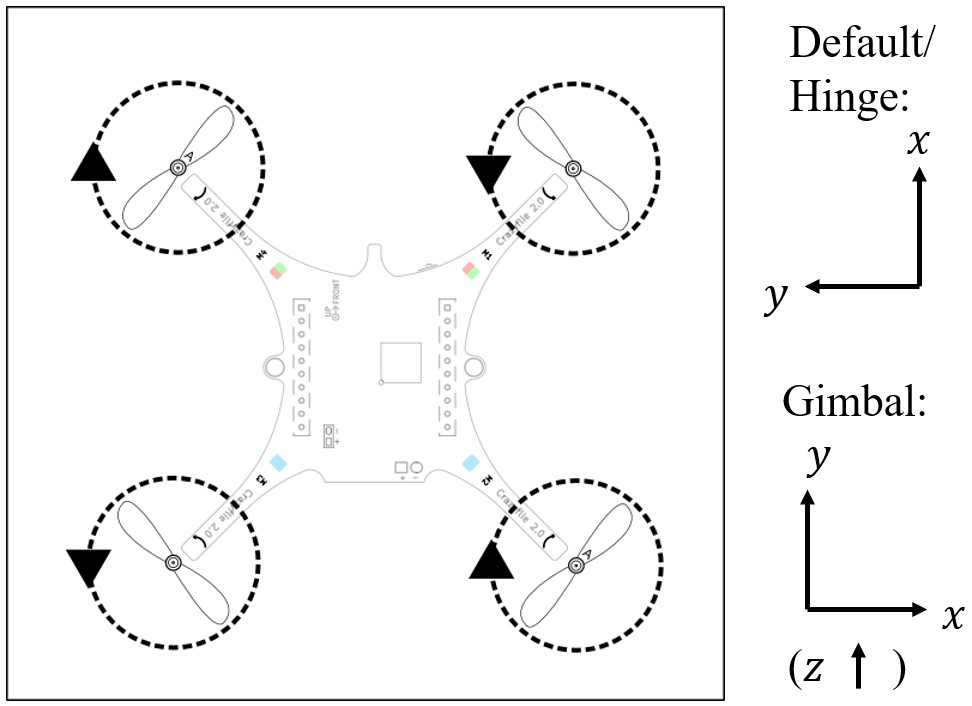

# Installation Guide
### Setting up environment, designing controller and implement on Crazyflie

This repository contains crazyflie-based gimbal commander run on a host PC (developed by [MACLAB](http://www.maclab.seas.ucla.edu/)). 


#### Set up Sublime to use Python3

Personal preference. Different text editor/compiler may be used.

Install Sublime-text: 
search online for key and steps.

Install Sublime-merge:
```
sudo apt-get installapt-transport-https
```
search online for key and steps.

Check Python3 path
```
which python3
```

In Sublime click `Tools -> Build System -> New Build System`, and paste (python3 path should be the same as in previous step)
```
{
 "cmd": ["/usr/bin/python3", "-u", "$file"],
 "file_regex": "^[ ]File \"(...?)\", line ([0-9]*)",
 "selector": "source.python"
}
```

Save file as `Python3.sublime-build`.

#### Crazyflie Python API

Config crazyflie library:
```
cd (current_folder)
pip3 install --user ./
```

#### Crazyflie clients

`git clone` from Github.

Install required python packages, referring to `README`.


## Low-level controller design and uploading

You can choose either Simulink-based method or directly write C code.

### C code template

git clone from my repositoty:


### Design in Simulink

Could use latest version of Matlab and Simulink in Windows. Haven't tried using Matlab in Linux yet.

Crazyflie configuration:



* Data type throughout Simulink model should be `'single'` or `'inherit'`, unless specified. If designing direct output to each motor, output data type should be `'uint16'` (value range from `0~65535`).

* Specify solver to be fixed-step, and step size 0.002 (500 Hz).

* Use Embedded code generator. Could use C/C++ code advisor to optimize the code, but 'default parameter behavior' under `Configuration Parameters -> Code Generation -> Optimization` should be 'tunable', if any.

* If any tunable parameters, set default values for them in Matlab workspace or Simulink Model workspace.

* Generate code. Should generate a folder `***_ert_rtw`.


### Upload code to Crazyflie

#### Set reference for new controller

* Copy folder `***_ert_rtw` to `crazyflie-firmware/src/modules/src/`.

* If it needs to configure data format of wireless communication, create new receive data packet in `crtp_commander_generic.c`.

* New `controller_***.c`, `controller_***.h`. Define inputs, outputs and parameters. Set `LOG_GROUP` and `PARAM_GROUP`.

* Reference of new controller in `controller.c` (`DEFAULT_CONTROLLER`, `ControllerFcns`) and `controller.h`.

* In `crazyflie-firmware/Makefile`, set:
	* Crazyflie sources (path)
	* Source files config (new `.o` files from `.c` files)
	* Compilation config (path)

#### Flow of data in firmware

* Packet sent from API (`commander.py` in `crazyflie-lib-python/cflib/crazyflie`).

* `crtp_commander_generic.c` in firmware, store in `setpoint`.

* `controller_***.c`

	Map `setpoint/sensor/state` to Simulink input ports;

	Output is either:

	In PID, `roll, pitch, yaw, thrust` that directly control motors by `powerDistribution()` in `power_distribution_stock.c`;

	Or in motor commands, `motorSetRatio()`.

#### Make code and upload

* 
```
cd crazyflie-firmware
make
```

* Connect crazyradio PA; long-press button on QC for 1.5 sec (enter load mode).

* 
```
make cload
```

If problem occurs during or after the make and upload, try

```
make clean
```

and proceed again.


## High-level controller design and implementation

### Communication with Crazyflie

Examples in `./examples`

Define new communication command package: 

* Make changes in `./cflib/crazyflie/commander.py`.

* Config cflib:
```
cd (current_folder)
pip3 install --user ./
```
